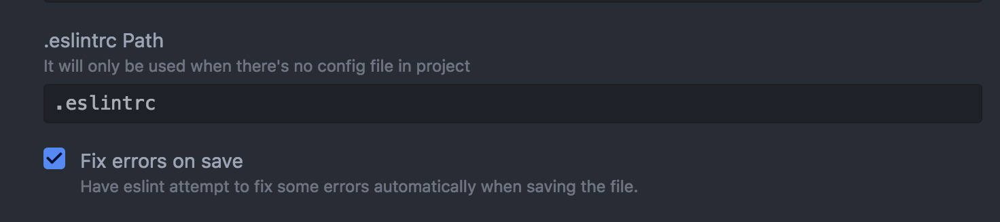

# React Boilerplate

Example project. We are using it as a start point for out applications or as a base for an education of our developers.

## Commands

| Command | Description |
| - | - |
| `yarn dev` | Run dev server |
| `yarn production` | Run production server |
| `yarn lint` | Check code with Eslint and Stylelint |
| `yarn build` | Build production |
| `yarn stats` | Run webpack statistic dashboard to analyze bundle size` |
| `yarn locales:extract` | Extract locales from the app  into `.pot` file |
| `yarn storybook` | Run storybook |
| `yarn test:acceptance` | Run acceptance tests |

## Frontend Architecture

### Project structure

- `app` - our application files. React JS app is here
- `.storybook` - storybook configuration files.
- `bin` - CI automation scripts
- `cypress` - acceptance tests
- `docs` - docs related documents, assets
- `public` - public static data, like favicon, robot.txt, that is not using in react js app and that doesn't have to go thought webpack process
- `webpack` - webpack configuration parts

#### Application structure

Inside `app` folder:

- `client` - client's entrypoint
- `server` - server's entrypoint
- `common` - code, that is shared between client and server
- `common/components` -  generic components. Core UI of our application. Elements, that can be publish and reused in other projects.
- `common/containers/blocks` - not generic components. specific for this project. API driven and can't be re-used in other projects
- `common/containers/forms` - application's forms
- `common/containers/layouts` -  layouts
- `common/containers/pages` - pages
- `common/helpers` - helpers.
- `common/locales` - localization files and template
- `common/redux` - redux modules. reducers and actions are here
- `common/routes` - routes definitions.
- `common/schemas` - normalizr schemas.
- `common/services` - configuration of 3rd party modules and services
- `common/store` - configuration of redux store
- `common/styles` - shared styles, like variables

### Code style

#### Eslint

We're using eslint to keep js and jsx code style consistent. Check that your IDE is using Eslint file from this repo. Anyway, pre-commit hook is checking lint with our internal installed eslint version. So if your IDE is not showing you the errors, but you have them in pre-commit hook, re-check IDE :D

##### Atom
Add plugin [linter-eslint](https://atom.io/packages/linter-eslint). Go to the plugin's configuration and enable option **Fix errors on save**



#### Stylelint

Stylelint is using to control the codestyle in style files. Configure your IDE to use config from this repo.

### Git flow

- **Stable branch** - `master`
- Don't push directly to the stable branch. Use PRs instead

**Workflow:**

1. Start a ticket with a new branch
2. Write code
3. Create Pull Request
4. Get an approve from one of your coworkers
5. Merge PR's branch with the stable branch

#### Name of the branches

We are not following some strict rule on this stage of branch naming. So we have a single rule for the branch names:
1. Make you branch names meaningful.

Bad example
```
fix-1
redesign
```

Good example
```
fix-signals-table
new-user-profile-page
```

##### JIRA tickets

If you are using JIRA as a task manager, follow this naming convention

```
[type of ticket]/[number of branch]-[short-title]

feature/FRB-123-change-titles
fix/FRB-431-retina-images
```

### Components

We are creating React application with component-approach. This means, what we try to decompose our UI into re-usable parts.

Try to make components PURE when it's possible. Avoid using redux or inner state for components in `app/common/components`.

Base component contains next files:

- `index.js` - base component
- `styles.scss` - styles file
- `index.story.js` - storybook file

See the [example component](./app/common/components/_Component_).

#### Recompose

Use recompose to create logic layout of your components. recompose allow us to split logic into multiple re-usable parts.

#### Storybook

Storybook is using as a UI library. We are using it as documentation for our UI. The goals are:

- help teammates to find the right component
- help to understand how to use the component
- avoid duplications

**The rule is**: write a story for all generic pure components and blocks and show all the existing variations.

Help your teammates understand from story how to use your component. Not just write the story of itself. Think about your colleagues.

#### Styling

Shortly about our styles:
- CSS modules
- PostCss with SCSS like style

We're using scoped styles, so you don't need to use BEM or other methodology to avoid conflicts in the styles.
In BEM terminology, you don't have to use elements. Use only block and modificators.

**If you feel that you also need an element - think, probably you have to extract a new component from this template.**

Bad example

```scss
.page {
  &__title {}
  &__content {
    &_active {}
  }
}
```

Good example

```scss
.root {} // root element
.title {}
.content {
  &.isActive {}
}
```

Use `is` prefix for the modificators.

##### Injecting styles to component

We are using `isomorphic style loader` to calculate critical CSS path. Use withStyles HOC to connect component and style. Use `withStyles` alias for import.

For example

```js
import React from 'react';
import PropTypes from 'prop-types';
import withStyles from 'withStyles';
import { compose } from 'recompose';
import styles from './styles.scss';

const Poster = ({ src, title }) => (
  <div className={styles.root} style={{ backgroundImage: `url(${src})` }} alt={title} />
);

Poster.propTypes = {
  children: PropTypes.node,
};

export default compose(
  withStyles(styles)
)(Poster);
```

#### Prop names

**Make names meaningful.**

```html
<Button d />
```

Good example
```html
<Button disabled />
```

**Make property for group of variants, not only of one specific case**

Bad example
```html
<Button red />
<Button blue />
<Button green />
```

Good example
```html
<Button color="red" />
<Button color="blue" />
<Button color="green" />
```

**Make property short**

Bad example

```html
<Button withLongValue />
```

Good example

```html
<Button long />
```

**Use `on` prefix for callbacks**

Bad example
```html
<Component change={someCallback} />
```

Good example
```html
<Component onChange={someCallback} />
```

**`true` if present**

`<Component black />` equals `<Component black={ true } />`

**`false` if missed**

`<Component />` equals `<Component black={ false } />`


#### Usage

Use component fully as a block. Don't make the components styles configurable outside. It has to have the deterministic number of possible variants.

Bad example

```html
<Component className="newClassname" />
```

This is a chore. Passing classname or style from parent component can solve a problem easily in short terms, but in the future, you will be updating your components and you will not remember about this modification. so you will not test it. and it would be a bug.

Good example

```html
<div className={styles.wrapper}>
  <Component disabled />
</div>
```

### Redux

We are using redux as our global state manager in the app. Our base store structure is:

- `data` - data redux modules.
- `form` - connect redux-form
- `routing` - connect react-router-redux
- `ui` - reducers of UI components

Actions and reducers are stored in the same file. We are using [`redux-actions`](npmjs.com/package/redux-actions) as a single way to create an action. See [example](./app/common/redux/ui/loading.js).

#### Selectors

Selectors are stored in [redux/index.js](./app/common/redux/index.js) file. Basic set of data selectors contains next methods:

```javascript
export const getMovie = (state, id) => denormalize(id, schemas.movie, state.data);

export const getMovies = (state, ids) => ids.map(id => getMovie(state, id));

export const getAllMovies = state => getMovies(state, Object.keys(state.data.movies));
```

### Data

#### API

We are using [redux-api-middleware](npmjs.com/package/redux-api-middleware) to make the API calls. It's use universal fetch internally.

Use method [`invoke`](./app/common/redux/api.js) to create API request actions.

#### Caching, Normalization

We use redux as a caching layer. Redux store contains data object, that has next structure

example
```js
data: {
  movies: {
    1: {
      id: 1,
      name: 'The Shawshank Redemption'
    },
    2: {
      id: 2,
      name: 'The Godfather'
    },
  },
  directors: {
    1: {
      id: 1,
      name: 'Francis Ford Coppola'
    }
  }
}
```

So all the data entities are grouped by collection and is stored in map, there key is `id` of the entity and `value` is entity itself.

This structure allows us to easily find entity in store by id.

Each API request contains normalization of the response. [Example](./app/common/redux/data/movies.js).

To normalize data we are using [`normalizr` package](npmjs.com/package/normalizr). Normalization schemas are store in [`schemas` folder](./app/common/schemas).

See an example of fetching and normalization of the data [here](./app/common/redux/data/movies.js).

#### Data usage on the pages

Use `connect` and `selectors` to get the store data on the page. Don't store the data directly on the page. Store identifier and get the value by id, with selector instead.

For example,

```js
export default compose(
  withStyles(styles),
  translate(),
  withRouter,
  provideHooks({
    fetch: ({ dispatch, params, setProps }) => dispatch(fetchMovie(params.id)).then((response) => {
      setProps({
        movieId: response.payload.result,
      });
    }),
  }),
  connect((state, ownProps) => ({
    movie: getMovie(state, ownProps.movieId),
  })),
)(MoviesDetailsPage);

```
After the fetch of the data we don't store the whole object, but just the id of the movie and then we get whole object with getMovie selector. It allow us to be sure, that redux store is only one source of data in our applications. It helps to avoid many bugs.

### Routing

1. You have to be able to load page information based only on the URL params.
2. Use the same URL as a main API endpoint of the page.

```
Page URL: /users
API request: get:/users

Page URL: /users/:id
API request: get:/users/:id

Page URL: /users/new
API request: post:/users
```

3. If you need to save the state of the page - use the URL query params. `e.g /users?page=1, /users?q=John Doe`
4. Make URLs meaningful


#### Fetching hooks

Pages and layouts are 2 places, there data can be fetched. WE don't fetch the data into blocks. Only in the containers, that are used as a component in Routes, so they are URL driven.

To fetch the data on the page we are using redial + react-router-redial

| hook | beforeTransition | afterTransition | client | server |
| - | - | - | - | - |
| `fetch` | + | - | + | + |
| `defer` | - | + | + | - |
| `server` | - | + | - | + |
| `done` | - | + | + | + |

We're additional passing `dispatch` and `getState` methods to the hooks, so you can access the store and dispatch an action.

### Authorization

TODO

### Testing

#### Acceptance testing

Cypress.io is used for E2E testing.

To run test, execute next command. You need server started and installed Chrome browser on your machine.

```sh
yarn test:acceptance
```

Tests are storing in [cypress folder](./cypress).

#### Unit testing

TODO. add jest to boilerplate

#### Visual regression testing

TODO. add argos CI to boilerplate

### Localization

We are using `gettext` standard for our basic localization process.

#### Extract localization template

```bash
yarn locales:extract
```

This command will extract string for localization into `locales/source.pot` file.

Use **Poedit** to create lang files based on .pot file.

Localization is configured in `common/services/i18next.js`. Check the code to see how to import `.po` file with new language to the app.

### Forms

We are using Redux-form as a single way to work with the forms.

#### Validation

We use per-form validation. For validation we are using [react-nebo15-validate](https://github.com/Nebo15/react-nebo15-validate/)

[Example](./app/common/containers/forms/MovieForm/index.js)

##### Add custom validation message

To add custom validation message, add it to ErrorMessages components. This component is used in Field components to show validation messages.

See the [existing customization](./app/common/components/ErrorMessages/index.js). Use this common in all places, when you need to display the error message based on error object.

### 3rd party services

Configuration of the 3rd party services is stored in [`common/services`](./app/common/services). See the example of i18next and validations configurations. They are separately connected to client and server entrypoints.

### SSR

### Node JS API

### Configuration

### Release & Deployment

### Build tools

## License

See [LICENSE.md](LICENSE.md).
